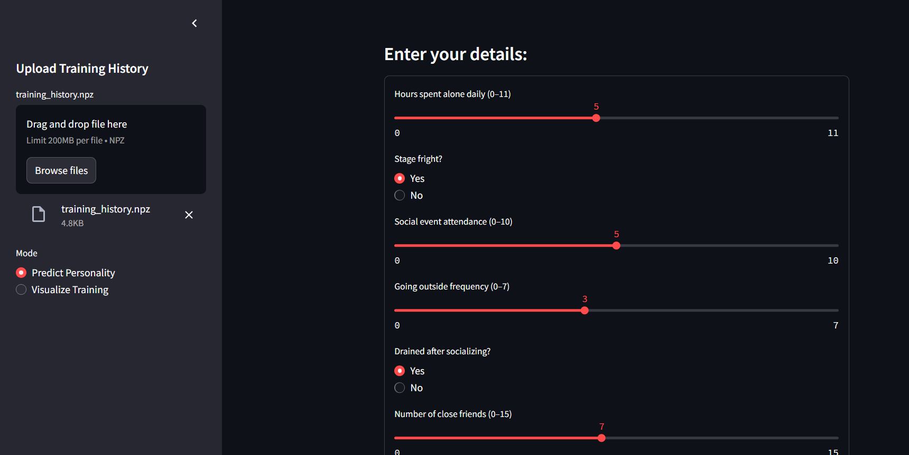
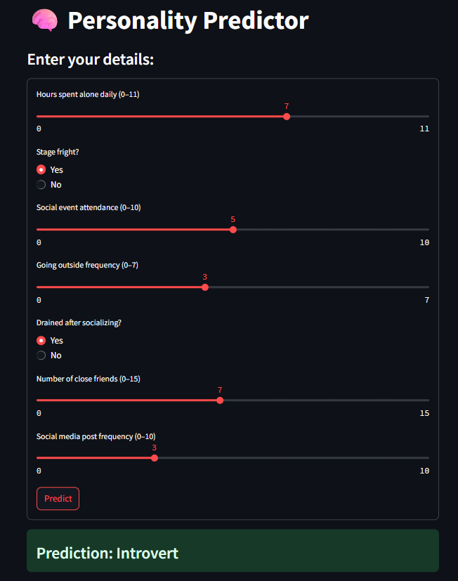
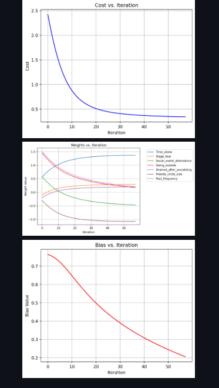

# 🧠 Personality Predictor

A machine learning project to classify whether a person is an **Introvert** or **Extrovert** using a custom logistic regression model and an interactive Streamlit app.

## 🔍 Overview

This project explores how behavioral features can be used to predict personality traits. It includes data cleaning, manual feature scaling, logistic regression from scratch, and a Streamlit web app for predictions and visualizing gradient descent.

During training, I noticed the model was **converging earlier than expected and that there were so many redundant iterations**, so I added **early stopping** to avoid unnecessary iterations.  
I also saved the **cost, weights, and bias values** from each iteration to visualize how the model learned over time.

---

## 💡 Features

- 📊 **Data Cleaning & Imputation**  
  Handled missing data to prepare a clean dataset.

- 📈 **Visualizations**  
  Explored relationships between features with clear and meaningful plots.

- 🧮 **Manual Logistic Regression**  
  Implemented using NumPy and gradient descent.

- ⏹️ **Early Stopping**  
  Added to stop training once convergence was reached, after observing the model didn't benefit from continuing for all iterations.

- 💾 **Saved Training History**  
  Stored cost, weights, and bias during training to allow in-depth visualization and understanding of the learning process.

- ⚖️ **Scaling (Z-Score) Without Libraries**  
  Standardized numerical features manually for full control and understanding.

- 🧠 **Accuracy**  
  - Training Accuracy: **91.94%**  
  - Test Accuracy: **91.38%**

- 🌐 **Streamlit App**  
  - **Prediction Tab**: Users input values and get predicted personality.  
  - **Visualization Tab**: Upload `training_history.npz` to see cost, weights, and bias updates during training.

- 🛠️ **Version Control**  
  Git & GitHub used with frequent commits documenting every major step.

--- 
### 🏠︎ Home Page

### 📸 Prediction Tab

### 📈 Visualization Tab

